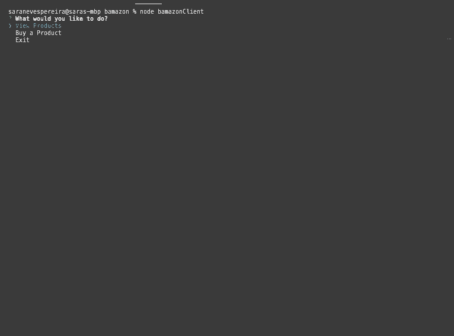
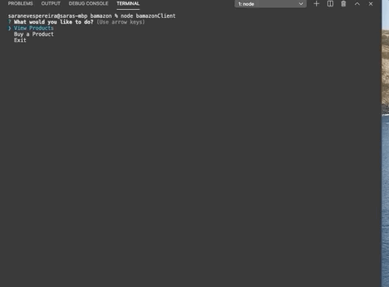

# Bamazon

 A node and mySQL app demonstrating the correlation of a database with user input activity. This is a back end exercise only, meaning the results are seen only on the console. 
 
 The user will follow a series of prompts allowing them to choose between a few choices: Viewing products, buying products or exiting the application. 

 Depending on the the choice, the CLI console will show different results.

 ## Sample Images

 Here are some images that can help visualize what this back-end app does.

 This is how we start the app and the choices seen in the initial menu that the user can choose from.

 

 From there the user has three choices. If the user chooses View Product:

 

 The same will happen if the user chooses to Buy a Product. The reason being, if the user chooses Buy Products directly, they might need to know what products they want to buy. 

 If the user chooses to buy a product: 

 

Once the user completes the purchase, the number of items bought are deducted from the MySQL Database. This is done through an "UPDATE" query to the MySQL databse.

If the user decides not to make a purchase the app will then cut the connection and end the program.




The same happens if the user decides to exit in the initial menu. 

## Getting Started

To create this back-end app there are a few steps to follow:

* set up a database in MySQL
* Connect that database to our .js file
* initiate a package.json to store our dependencies
* require mysql and prompt from the NPM library

# Instalation

To initiate a package.json all you have to do is type on your terminal

```
npm init -y
```

This willl create a package.json without having you answer any questions. 

Once that is done, it is necessary to require the other packages, which will be pur dependencies, from the [NPM library](https://www.npmjs.com/). 

In this back-end app I used the following dependencies:

These were the basic ones to create this app

```
npm install mysql
````

```
npm install inquirer
```

These one I installed so I could beautify how the console displayed the results.

```
npm install cli-table3
```

```
npm install colors
```

The first one allowed me to create a nice looking table that made it easier to consume the data from the MySQL database. The second, allowed me to give color to some words and numbers and make them pop out in the console. 

Once all these dependencies were installed, then it made it possible to create the app. It is important to note that the beautifying npm packages were only installed after the app was already functional. 

## Built With

* Javascrip
* Node
* Inquirer - [NPM Library](https://www.npmjs.com//package/inquirer#prompt)
* MySQL WorkBench
* MySQL - [NPM Library](https://www.npmjs.com/package/mysql)
* CLI-Table3 - [NPM Library](https://www.npmjs.com/package/cli-table3)
* Colors - (https://www.npmjs.com/package/colors)

## Authors

* Sara Neves Pereira

## License

This project is licensed under the UofA Coding Certificate BootCamp license.


